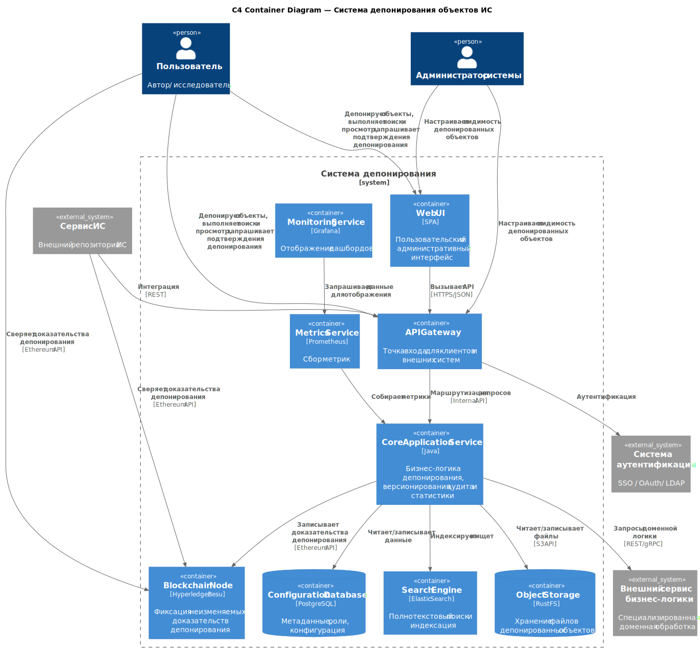

# Deposition System (Scientific Materials)

This repository contains the core of a **scientific materials deposition system** that combines:

1. **Long-term preservation** mechanisms for digital objects (content files and preservation metadata).
2. **Standardized metadata description** based on **PREMIS** (Preservation Metadata: Implementation Strategies).
3. **Cryptographically verifiable authorship attribution and provenance fixation** using **distributed ledger technologies**.

The system is designed to support depositing, versioning, auditability, search/discovery, and verifiable evidence of deposit actions.

## Deployment

Deployment instructions and infrastructure-related materials are located in `./deposition_system_dev_ops`.

## Technology Stack

### Backend
- **Java + Spring Framework**: core business logic, REST APIs, integration with storage/search/auth/blockchain.

### Frontend
- **React + TypeScript**: single-page application (SPA) for users and administrators.

The UI is developed in a separate Git submodule located in `deposition_system_ui/`.

### Data Storage & Search
- **PostgreSQL**: relational storage for configuration, users/roles (where applicable), and structured metadata.
- **OpenSearch**: indexing and full-text search over deposited objects and metadata.
- **RustFS (S3-compatible object storage)**: storing deposited binary content (files) and large payloads.

### Blockchain / Distributed Ledger
- **Hyperledger Besu**: permissioned Ethereum-compatible blockchain network used to record immutable evidence of deposit actions.
- **Web3Signer** (used alongside the authentication node): external signer for protecting private keys used for blockchain transactions.

### Authentication & Authorization
- **Keycloak**: SSO / OAuth2 / OpenID Connect identity provider for end-user and admin authentication.

### Observability
- **Prometheus**: metrics collection.
- **Grafana**: dashboards and visualization.

## High-level Architecture

## Main Nodes (recommended deployment split)

The recommended deployment architecture distributes components across separate virtual machines according to their functional role and resource usage.

### 1) Application node
- **Resources**: 4 vCPU, 8 GB RAM, 40–60 GB SSD
- **Hosts**:
  - **Nginx** (reverse proxy)
  - **Backend application** (Spring)
  - **Frontend application** (React SPA)

### 2) Authentication node
- **Resources**: 2 vCPU, 4 GB RAM, 30–40 GB SSD
- **Hosts**:
  - **Keycloak** (identity provider)
  - **Web3Signer** (secure transaction signing for blockchain interactions)

### 3) Data storage and search node
- **Resources**: 4 vCPU, 16 GB RAM, 100–120 GB SSD
- **Hosts**:
  - **PostgreSQL** (metadata/configuration DB)
  - **OpenSearch** (indexing and full-text search)

### 4) Blockchain network node
- **Resources**: 8 vCPU, 16 GB RAM, 100–150 GB SSD
- **Hosts**:
  - **Hyperledger Besu validators**
  - **Besu RPC node** (Ethereum JSON-RPC endpoint)

### 5) Object storage node
- **Resources**: 4 vCPU, 8 GB RAM, 160–200 GB SSD
- **Hosts**:
  - **RustFS nodes** (S3-compatible object storage)

### 6) Monitoring node
- **Resources**: 2 vCPU, 4 GB RAM, 100 GB SSD
- **Hosts**:
  - **Prometheus**
  - **Grafana**

## Configuration (environment-dependent settings)

The backend is configured via Spring Boot properties. In the default configuration (`application/src/main/resources/application.yml`) most values are expected to be provided via **environment variables** / externalized configuration.

### Required settings

#### Server
- `server.port` — HTTP port to bind.

#### PostgreSQL
- `spring.datasource.url`
- `spring.datasource.username`
- `spring.datasource.password`
- `spring.liquibase.enabled` — enables/disables Liquibase migrations.

#### OAuth2 Resource Server (Keycloak)
- `spring.security.oauth2.resourceserver.jwt.issuer-uri` — issuer URI for JWT validation.

#### Integrations

**Ethereum / Besu**
- `integration.ethereum.rpc-url` — Besu JSON-RPC endpoint.
- `integration.ethereum.gas-limit-integer`
- `integration.ethereum.chain-id`
- `integration.ethereum.from-address` — sender address used by the service.
- `integration.ethereum.gas-price-wei` — optional, defaults to `0`.

**OpenSearch**
- `integration.opensearch.endpoint` — OpenSearch endpoint (optional in config template, but required if search/indexing is used).
- `integration.opensearch.descriptive-metadata-index` — defaults to `descriptive-metadata`.
- `integration.opensearch.object-index` — defaults to `objects`.

**S3 / RustFS**
- `integration.s3.endpoint`
- `integration.s3.region`
- `integration.s3.access-key`
- `integration.s3.secret-key`
- `integration.s3.bucket-name`
- `oscm.integration.s3.presign-endpoint` — endpoint used for pre-signed URL generation.

**Keycloak (admin integration)**
- `oscm.integration.keycloak.base-url`
- `oscm.integration.keycloak.realm`
- `oscm.integration.keycloak.admin-client-id`
- `oscm.integration.keycloak.admin-client-secret`

### Optional tuning parameters

#### File upload limits (multipart)
- `oscm.spring.servlet.multipart.max-file-size` (default: `1GB`)
- `oscm.spring.servlet.multipart.max-request-size` (default: `1100MB`)
- `oscm.spring.servlet.multipart.file-size-threshold` (default: `1MB`)
- `oscm.spring.servlet.multipart.location` (default: `${java.io.tmpdir}`)

#### Tomcat limits
- `oscm.server.tomcat.max-http-form-post-size` (default: `-1`)
- `oscm.server.tomcat.max-swallow-size` (default: `-1`)

#### Thread pools
The system uses dedicated executor pools for statistics, indexing and background jobs:
- `statistics.events.executor.*`
- `deposition.indexing.executor.*`
- `deposition.job.executor.*`
